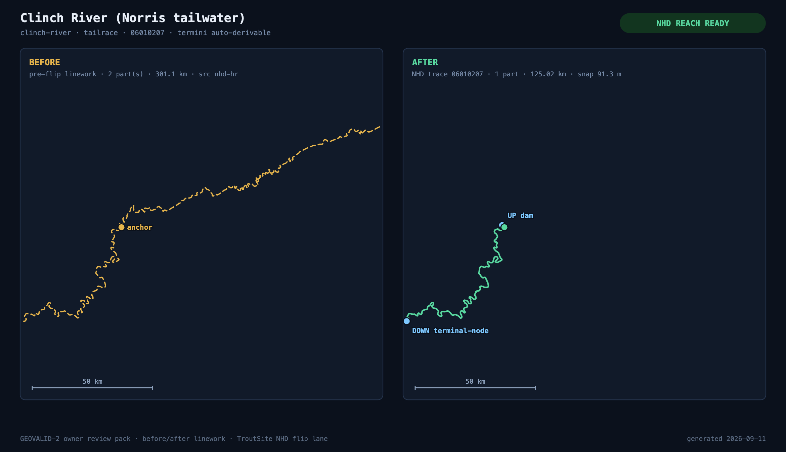

# NHD-BEFORE-AFTER — owner review pack (GEOVALID-2)

> Status: `geoconv/nhd-validate` lane, 2026-09-11. This pack is what the owner
> reviews to approve the production geometry flip (replacing
> `apps/web/public/atlas/rivers.geojson` linework with traced NHD reaches).
> The flip itself is a later, separately approved lane — nothing here touches
> `apps/web/public`.

## What this pack is

One before/after panel per water in the review set (**32 waters = all 12 catalog
tailwaters + 20 featured waters** — stocked, gauge-anchored waters first):

- **BEFORE** (amber, dashed when multi-part): the linework currently shipped in
  `rivers.geojson` (read-only copy at base commit). This is what phones render today.
- **AFTER** (green): the traced, validated NHD reach —
  `data/nhd/derived/reach-<id>.geojson`. Today that exists only for
  **clinch-river** (the reference HU8 06010207 output from GEOCONV-0); the
  remaining 31 panels show the planned AFTER state until GEOFANOUT-1 converts
  each water's HU8. Re-render after fan-out lands (commands at the bottom) —
  this pack is the standing approval artifact for the flip.
- Each panel shows: anchor dot (gauge or label anchor), UP/DOWN terminus dots on
  traced reaches, the termini plan + human-review notes on pending ones, a scale
  bar, and panel stats (parts / km / source / anchor snap).

SVGs (`docs/nhd-before-after/<id>.svg`) are the committed source of truth; PNGs
are captured from them via headless Chrome (`--png`, a maintainer render step —
never a build dependency).

## The reference proof: clinch-river



The shipped `clinch-river` feature (left) is a two-part, 301 km line whose bounds
reach −82.89° — upstream of Norris Dam, into water the catalog entry does not
describe. The traced reach (right) is one connected, flow-directed 125 km line
from Norris Dam to the Kingston mouth: anchor snap 91 m, all junction gaps 0 m,
B13 validation PASS (`data/nhd/derived/reach-clinch-river.validate.json`).

## Review set

| water                                                                         | type     | status          | UP terminus                          | DOWN terminus                               | human review          |
| ----------------------------------------------------------------------------- | -------- | --------------- | ------------------------------------ | ------------------------------------------- | --------------------- |
| [barren-fork-river](nhd-before-after/barren-fork-river.png)                   | river    | pending fan-out | `headwater` (high)                   | `mouth` (medium)                            | no-endpoint-evidence  |
| [beaverdam-creek](nhd-before-after/beaverdam-creek.png)                       | creek    | pending fan-out | `headwater` (high)                   | `mouth` (medium)                            | no-endpoint-evidence  |
| [big-rock-creek](nhd-before-after/big-rock-creek.png)                         | creek    | pending fan-out | `headwater` (high)                   | `mouth` (medium)                            | no-endpoint-evidence  |
| [boiling-fork-creek](nhd-before-after/boiling-fork-creek.png)                 | creek    | pending fan-out | `headwater` (high)                   | `mouth` (medium)                            | no-endpoint-evidence  |
| [boone-tailwater](nhd-before-after/boone-tailwater.png)                       | tailrace | pending fan-out | `dam:Boone Lake` (high)              | `confluence:Fort Patrick Henry Lake` (high) | —                     |
| [bradley-creek](nhd-before-after/bradley-creek.png)                           | creek    | pending fan-out | `headwater` (high)                   | `confluence:Woods Reservoir` (high)         | —                     |
| [brush-creek-cocke](nhd-before-after/brush-creek-cocke.png)                   | creek    | pending fan-out | `headwater` (high)                   | `mouth` (medium)                            | no-endpoint-evidence  |
| [buffalo-creek-grainger](nhd-before-after/buffalo-creek-grainger.png)         | creek    | pending fan-out | `headwater` (high)                   | `mouth` (medium)                            | no-endpoint-evidence  |
| [buffalo-river](nhd-before-after/buffalo-river.png)                           | river    | pending fan-out | `headwater` (high)                   | `confluence:Duck River` (high)              | —                     |
| [calfkiller-river](nhd-before-after/calfkiller-river.png)                     | river    | pending fan-out | `headwater` (high)                   | `mouth` (medium)                            | no-endpoint-evidence  |
| [cane-creek](nhd-before-after/cane-creek.png)                                 | creek    | pending fan-out | `headwater` (low)                    | `mouth` (low)                               | reach-split-ambiguous |
| [caney-fork-river](nhd-before-after/caney-fork-river.png)                     | tailrace | pending fan-out | `dam:Center Hill Lake` (high)        | `mouth` (medium)                            | no-endpoint-evidence  |
| [caney-fork-upper](nhd-before-after/caney-fork-upper.png)                     | river    | pending fan-out | `headwater` (high)                   | `confluence:Center Hill Lake` (high)        | —                     |
| [charles-creek](nhd-before-after/charles-creek.png)                           | creek    | pending fan-out | `headwater` (high)                   | `mouth` (medium)                            | no-endpoint-evidence  |
| [citico-creek](nhd-before-after/citico-creek.png)                             | creek    | pending fan-out | `headwater` (high)                   | `mouth` (medium)                            | no-endpoint-evidence  |
| [clear-creek-obed](nhd-before-after/clear-creek-obed.png)                     | creek    | pending fan-out | `headwater` (high)                   | `confluence:Obed River` (high)              | —                     |
| [clear-fork](nhd-before-after/clear-fork.png)                                 | creek    | pending fan-out | `headwater` (high)                   | `confluence:New River` (high)               | —                     |
| [clinch-river](nhd-before-after/clinch-river.png)                             | tailrace | NHD reach ready | `dam:Norris Lake` (high)             | `mouth` (high)                              | —                     |
| [collins-river](nhd-before-after/collins-river.png)                           | river    | pending fan-out | `headwater` (high)                   | `mouth` (low)                               | no-endpoint-evidence  |
| [cosby-creek](nhd-before-after/cosby-creek.png)                               | creek    | pending fan-out | `headwater` (high)                   | `mouth` (low)                               | no-endpoint-evidence  |
| [cumberland-river](nhd-before-after/cumberland-river.png)                     | river    | pending fan-out | `headwater` (low)                    | `confluence:Lake Barkley` (high)            | ambiguous-notes       |
| [daddys-creek](nhd-before-after/daddys-creek.png)                             | creek    | pending fan-out | `headwater` (high)                   | `confluence:Obed River` (high)              | —                     |
| [doe-creek-johnson](nhd-before-after/doe-creek-johnson.png)                   | creek    | pending fan-out | `headwater` (high)                   | `mouth` (low)                               | no-endpoint-evidence  |
| [duck-river-tailwater](nhd-before-after/duck-river-tailwater.png)             | tailrace | pending fan-out | `dam:Normandy Lake` (high)           | `mouth` (low)                               | reach-split-ambiguous |
| [elk-river](nhd-before-after/elk-river.png)                                   | tailrace | pending fan-out | `dam:Tims Ford Lake` (high)          | `mouth` (low)                               | reach-split-ambiguous |
| [french-broad-river](nhd-before-after/french-broad-river.png)                 | tailrace | pending fan-out | `dam:Douglas Lake` (high)            | `confluence:Holston River` (high)           | —                     |
| [ft-patrick-henry-tailwater](nhd-before-after/ft-patrick-henry-tailwater.png) | tailrace | pending fan-out | `dam:Fort Patrick Henry Lake` (high) | `confluence:Holston River` (high)           | —                     |
| [hiwassee-river](nhd-before-after/hiwassee-river.png)                         | tailrace | pending fan-out | `dam:Apalachia Lake` (low)           | `confluence:Chickamauga Lake` (high)        | dam-name-unverified   |
| [obey-river](nhd-before-after/obey-river.png)                                 | tailrace | pending fan-out | `dam:Dale Hollow Lake` (high)        | `mouth` (low)                               | no-endpoint-evidence  |
| [parksville-tailwater](nhd-before-after/parksville-tailwater.png)             | tailrace | pending fan-out | `dam:Parksville Lake` (high)         | `confluence:Hiwassee River` (high)          | —                     |
| [south-holston-river](nhd-before-after/south-holston-river.png)               | tailrace | pending fan-out | `dam:South Holston Lake` (high)      | `confluence:Boone Lake` (high)              | —                     |
| [watauga-river](nhd-before-after/watauga-river.png)                           | tailrace | pending fan-out | `dam:Wilbur Lake` (high)             | `confluence:Boone Lake` (high)              | —                     |

Termini confidence rubric and the auto-derivable rule are frozen in
`data/nhd/termini.json` (schema `trout/nhd-termini/1`; grammar =
docs/NHD-CONVENTIONS.md §6.2). 30 of the 105 flowing waters are fully
auto-derivable; 75 carry an explicit human-review token (mostly
`no-endpoint-evidence` — the YAML notes name no receiving water, which is a
content gap, not a geometry one). All 43 stillwaters are recorded with null
termini (no reach will ever be traced). The table covers **148 catalog waters**
— the brief said 146; the catalog contains 148 YAMLs with 1:1 geometry
features, so the table is a superset of any 146-water subset (see PROGRESS.md).

## Regression gates behind this pack

`node scripts/nhd-validate.mjs` (suite: `scripts/nhd-validate.mjs` +
`scripts/nhd-validate-lib.mjs`; tests: `tests/nhd-validate.test.mjs`) enforces,
per reach and catalog-wide:

1. every traced reach is ONE connected component of its graph (junction-gap
   continuity ≤ 50 m against the audit sidecar);
2. termini assertions — tailwaters start at their dam (YAML
   `waterbodyType: tailrace`), non-tailwaters end at mouth/confluence,
   cross-checked against termini.json;
3. no two waters share a bbox / duplicate linework (B13 Boone–SoHo class);
4. no multi-longitude disconnected reaches (B13 Cane Creek class);
5. length sanity vs stated river miles where YAML notes state them;
6. anchor snap ≤ 250 m (conventions §6.1), else flagged or explicitly waived.

Green today: 0 FAIL, 0 REVIEW, 104 pending-fan-out waters tracked (`--strict`
flips pending to FAIL once GEOFANOUT-1 lands). The B13 known-bad regression
(19 waters from docs/GEO-AUDIT.md) reads **all FIXED** — full per-water table
in PROGRESS.md.

## How to re-render after fan-out

```
node scripts/nhd-validate-pack.mjs --png          # whole set
node scripts/nhd-validate-pack.mjs --water <id> --png
node scripts/nhd-validate.mjs --strict            # post-fan-out gate
```

## Sources

- BEFORE: `apps/web/public/atlas/rivers.geojson` (TIGER/NHDPlus-era linework,
  untouched in this lane)
- AFTER: `data/nhd/derived/reach-*.geojson` (USGS NHD Best Resolution HU8
  traces; provenance per docs/NHD-CONVENTIONS.md §2 and
  `data/nhd/hu8/<hu8>.meta.json`)
- Termini: `data/nhd/termini.json` (drafted from catalog YAML + anchors by six
  subagent batches, reconciled and schema-validated by the suite)
